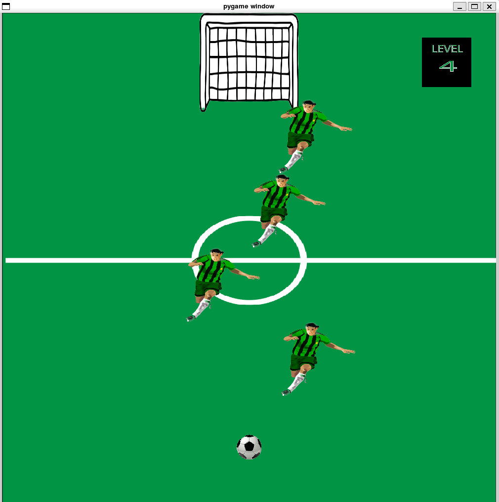
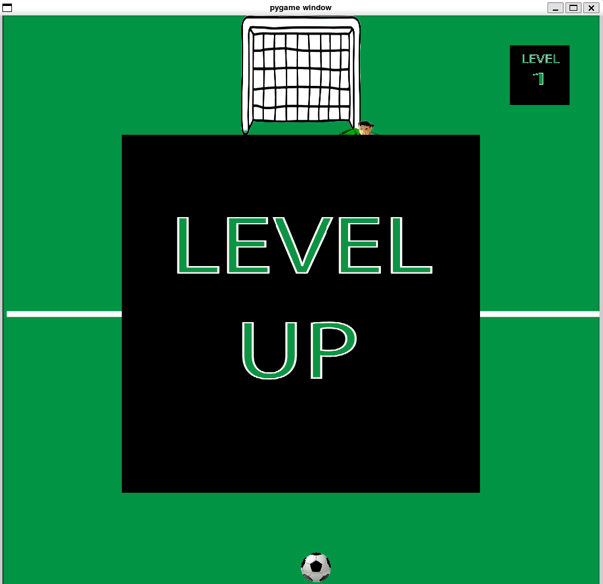
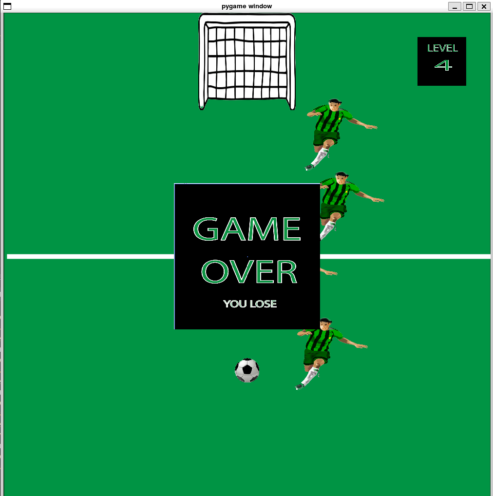

# GAME OVERVIEW:
### This miniature soccer game is an interactive take the game of fooseball. You are given complete control over the soccer ball as you try to navigate it through the defenders in hopes of reaching the goal. At first the singular defender moving horizontally across the screen may seem like a breeze to get by, but every time you reach the goal another defender is placed on the field and the velocity of the ball is increased, making it even harder to control your movements. 

## Project Presentation:
If you would like to learn more about how our game works or see the game running live, check out this presentation video [here](https://youtu.be/XL9JcgGzepw)!

## Obtaining Project Software:
If you would like to take a stab at our game yourself, download our game from our [project repository](https://github.com/olincollege/soccer-goal-scorer)! The installation and process to run can be found in our READ.ME file.
Pygame and Pytest will need to be installed in order to run this game as well.

## About The Authors:
### Bhargavi Deshpande:
My name is Bhargavi Deshpande and I'm a first year at Olin College. In my free time I love to skateboard, lift, and of course, play soccer. I played soccer for 13 years as a center back where all I had to do was body check people.

### Bertrand Aristide Inshuti:
My name is Bertrand Aristide Inshuti, and I am originally from Rwanda. I am currently a freshman at Babson College and also taking classes at Olin College. Working alongside my friend Bhargavi on our interactive soccer game project, developed using Python, was a truly enriching experience. This project not only allowed us to delve into our passion for soccer but also to harness our programming skills in a collaborative and engaging environment. 

